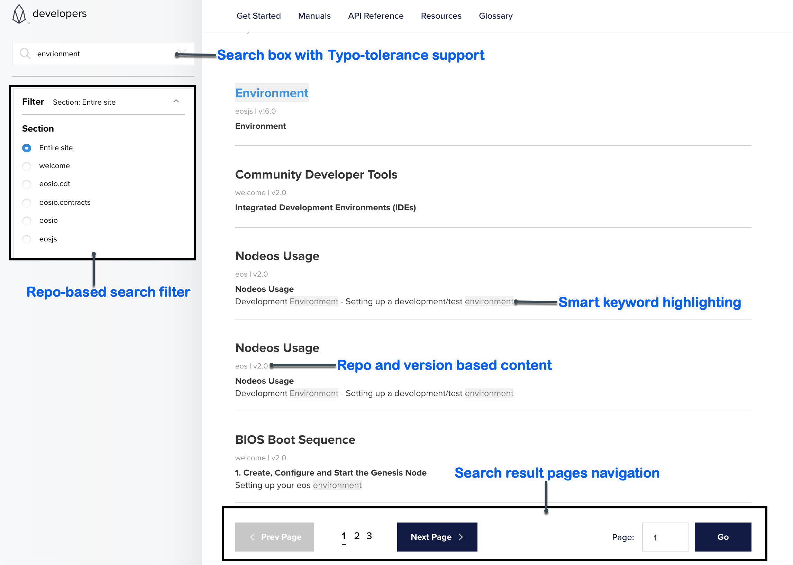

# Portal Page Layout 

The pages on the EOSIO Developers Portal are designed to reflect a 3-panel layout design for structured content consumption and usability. An example documentation page renders as shown below: 

## Left-side Panel

The left-side panel of a given page displays the following UI components: 

(1) Search field: A global search field with typo-tolerance support. See Portal Search for more details. 
(2) Repository selector: A dropdown to select an EOSIO repo-based documentation. Repository version selector: A drop-down to select version-specific documentation. 
(3) Current Page: The current page that is displayed in the center panel. 
(4) Repository content navigation menu: A navigation pane to access all the documentation topics in the selected repository. 

## Center Panel
The center panel of a given page displays the following UI components: 

(5) Top-level navigation: A static navigation bar available on all the pages of the portal that contains the core content categories.
(6) Breadcrumb Navigation:  A page trail to indicate the current location and to trace your way back.
(7) Main Page Heading: 
(8) Section Title: The title of the first section on the page
(9) Content area:  The consumable documentation content

## Right-side Panel

(10) Submit a Pull Request (PR): A way to contribute to EOSIO documentation by submitting a PR to the selected Github repository. For detailed instructions on using the Edit button, see the Get Involved section of the EOSIO Developers Portal. 
(11) File Repo Issue: File a new issue in the selected Github repository. For detailed instructions on using the Request Changes button, see the Get Involved section of the EOSIO Developers Portal. 
(12) Copy Permalink: A permanent link to the portal page that will not expire. You can use this link to share with others or bookmark it for later reference. 
(13) Github Links: Links to resources in Github related to the selected repository 
(14) On-page navigation: A secondary navigation panel to navigate through the other sections of the Current Page (4). 

## Responsive Design

To build a great user experience on tablets, mobile devices, and desktops, we have implemented a responsive design layout. 

# Content and Site Navigation

Home Page

The **Home** page of the developers portal is refactored into logical groupings around topics such as getting started, learning about the EOSIO stack, API reference, and helpful developer resources. 

Below is a screenshot of the Home page:

<pic>

## Repository Switching 
The Developers Portal displays documentation content processed from the source repositories in Github. The Repository selector (See (2) in Figure 1.0) on the left-side panel of a portal page allows convenient access to repo-based documentation. 

### To Change Repositories
To switch between repositories:

1. On a given page, click the repository selector dropdown. 
2. Select a repository from the list. 

### To Change Versions
To select a repository version: 

1. On a given page, click on the repository version selector dropdown. 
2. Select an available version of the repository.

# Portal Search 

The developers portal provides a robust documentation search feature. The search result is scoped within its version of a repository. To implement it, we have integrated Algolia DocSearch into our project. An example search result from the developers portal is shown in the below screenshot:

